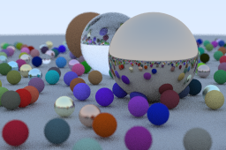

# Ray tracer in Rust

show image.ppm

Ray tracer implemented in Rust. Implementation based on the original [Ray Tracing in One Weekend ](https://raytracing.github.io/books/RayTracingInOneWeekend.html) book and its port to [rust](https://github.com/misterdanb/raytracinginrust/tree/master).